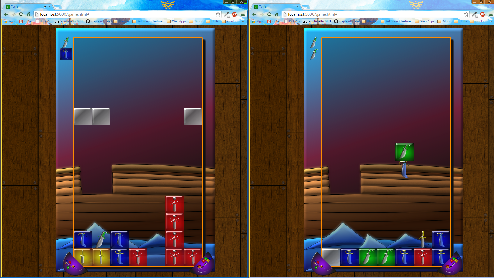

=======
captotetris
===========

Captotetris - A (soon to be) multiplayer tetris game with a competitive aspect. 
Based on puzzle pirates "swordfighting" puzzle game. 
There is no multiplayer yet, but it will be a no brainer. I just need some more time. 
All custom art ( not that it's exactly brilliant lol )

There is some cool stuff in here. First I have an algorithm that maintains the aspect ratio of not only
the canvas but everything in it. So everthing scales really well.
I also have a formula which checks for window.devicePixelRatio and accomodates for it. 
Meaning I can provide better image quality for retina displays or even galaxys4 screens ( which have DPR of 3 ).
Also, I wrote this in my canvas framework that I made.

Here is a link to the latest playable version: <a href="http://captotetris.herokuapp.com/">Play!</a>

<h1>Latest Version<h1>
</img>
</img>
</img>
</img>

<h1>Some old version ( From new to old)<h1>
</img>
</img>
</img>
</img>
</img>
</img>
</img>
</img>
</img>
</img>
</img>
</img>
</img>
</img>
</img>
</img>

